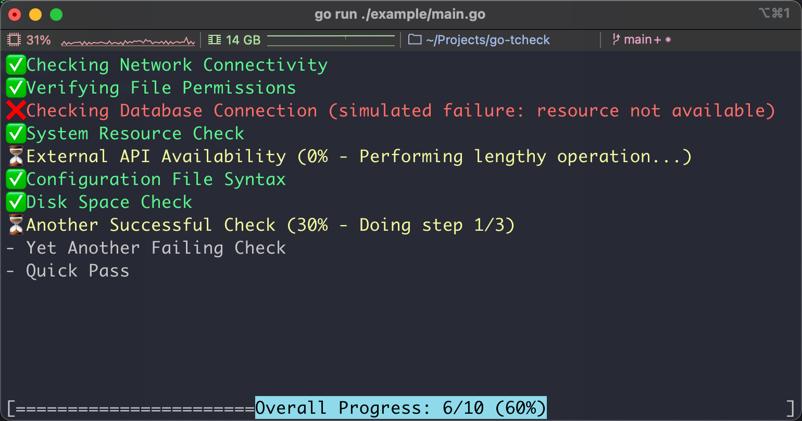

# go-tcheck

## Introduction

`go-tcheck` is a lightweight package written in [Go](https://go.dev/), designed to help developers create dynamic, real-time checks and task progress displays for their CLI applications *(especially [tcell](https://github.com/gdamore/tcell) based applications)*.

It provides a simple API for managing a range of asynchronous tasks and displaying their execution status, sub progress and final results in a user-friendly manner.



## Features

- Real-time progress updates
- Concurrent task management
- Customizable UI
- Scrolling support
- Error reporting

## Usage

### Initialize

```go
// Assume you have already created a tcell.Screen instance
var s *tcell.Screen

// Create CheckManager and UIRenderer
var ui *tcheck.UIRenderer
manager := tcheck.NewCheckManager(func() {
    if ui != nil {
        ui.Draw() // Trigger a redraw
    }
}, 3) // Allow up to 3 checks to run concurrently
ui = tcheck.NewUIRenderer(s, manager)
```

### Add Checks

```go
manager.AddCheck(
    "Checking Network Connectivity", // Check name
    CheckNetworkConnectivity, // Check function
)

func CheckNetworkConnectivity(reporter tcheck.SubProgressReporter) error {
    // You can define multiple sub-progress steps in a check function.
    target1 := "192.168.66.1"
    reporter.ReportSubProgress(0, "Pinging "+target1+"...")
    cmd := exec.Command("ping", "-c", "1", target1)
    err := cmd.Run()
    if err != nil {
        reporter.ReportSubProgress(50, "Ping "+target1+" failed")
        return fmt.Errorf("ping failed: %v", err)
    }

    target2 := "google.com"
    reporter.ReportSubProgress(50, "Pinging "+target2+"...")
    cmd = exec.Command("ping", "-c", "1", target2)
    err = cmd.Run()
    if err != nil {
        reporter.ReportSubProgress(100, "Ping "+target2+" failed")
        return fmt.Errorf("ping failed: %v", err)
    }

    // Use `ReportSubProgress` to report the progress of the check.
    reporter.ReportSubProgress(100, "Network connectivity OK")
    return nil
}
```

### Run All Checks

```go
// Start running checks in the background
go manager.RunAllChecks()

// Start the UI event loop (this will block until quit)
ui.Run()
```

### Get Check Results

```go
// The following code should be placed after `ui.Run()`
failed := []string{}
for _, item := range manager.GetItems() {
    if item.Status == tcheck.StatusFailed {
        // Collect the information of failed checks
        failed = append(failed, fmt.Sprintf("%s: %v", item.Name, item.Error))
    }
}

if len(failed) > 0 {
    // If any check failed, do something...
    fmt.Println("❌ Exiting due to failed checks.")
    for _, fail := range failed {
        fmt.Printf(" - %s\n", fail)
    }
    os.Exit(1)
}

// If all checks passed, continue with the next steps
fmt.Println("✅ All checks passed! Moving to the next step...")
fmt.Println("Welcome!")
```

## Example

See [example/main.go](./example/main.go) for a complete example.
