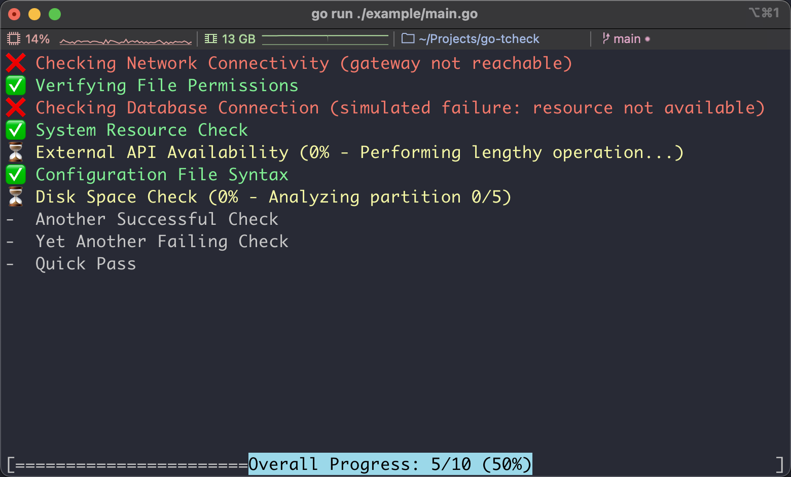

# go-tcheck

## Introduction

`go-tcheck` is a lightweight package written in [Go](https://go.dev/), designed to help developers create dynamic, real-time checks and task progress displays for their CLI applications *(especially [tcell](https://github.com/gdamore/tcell) based applications)*.

It provides a simple API for managing a range of asynchronous tasks and displaying their execution status, sub progress and final results in a user-friendly manner.

## Features

- Real-time progress updates
- Concurrent task management
- Customizable UI
- Scrolling support
- Error reporting